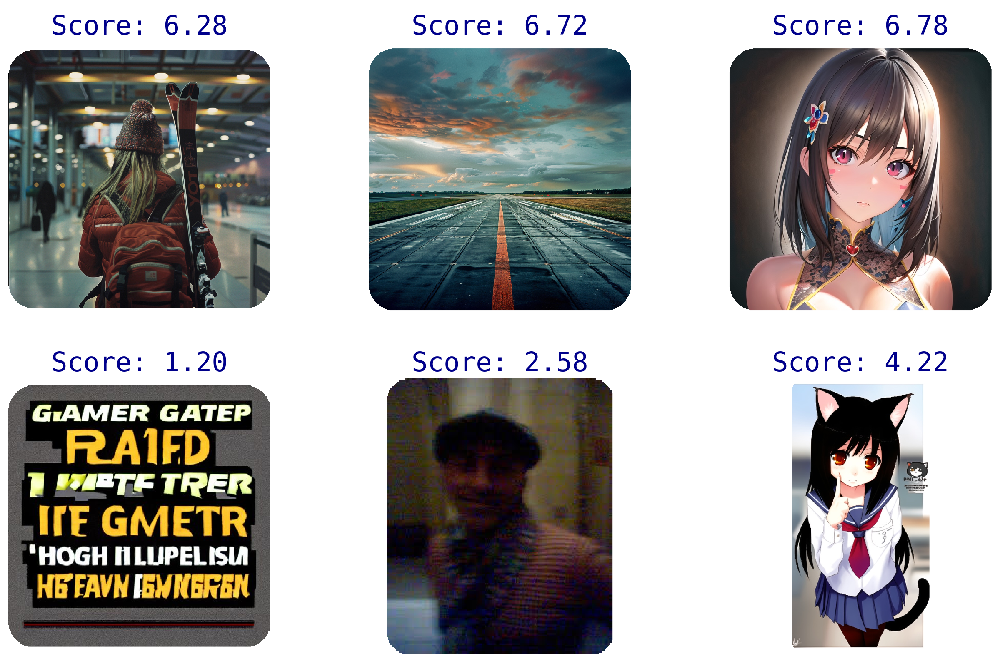

# Aesthetic Predictor V2.5

Aesthetic Predictor V2.5 is a SigLIP-based predictor that evaluates the aesthetics of an image on a scale from 1 to 10.

Compared to [Aesthetic Predictor V2](https://github.com/christophschuhmann/improved-aesthetic-predictor), it has been improved to evaluate a wider range of image domains such as illustrations.

<p align="center">
  
</p>

Unlike V2, **_5.5+_** is considered to be a great aesthetic score.

**You can try Aesthetic Predictor V2.5 at Hugging Face Spaces!**

[](https://huggingface.co/spaces/discus0434/aesthetic-predictor-v2-5)

## Installation

```bash
pip install aesthetic-predictor-v2-5
```

## Usage

This repository features an interface similar to Hugging Face Transformers, almost same as [Simple Aesthetics Predictor](https://pypi.org/project/simple-aesthetics-predictor/), making it easy to use.

```python
from pathlib import Path

import torch
from aesthetic_predictor_v2_5 import convert_v2_5_from_siglip
from PIL import Image

SAMPLE_IMAGE_PATH = Path("path/to/image")

# load model and preprocessor
model, preprocessor = convert_v2_5_from_siglip(
    low_cpu_mem_usage=True,
    trust_remote_code=True,
)
model = model.to(torch.bfloat16).cuda()

# load image to evaluate
image = Image.open(SAMPLE_IMAGE_PATH).convert("RGB")

# preprocess image
pixel_values = (
    preprocessor(images=image, return_tensors="pt")
    .pixel_values.to(torch.bfloat16)
    .cuda()
)

# predict aesthetic score
with torch.inference_mode():
    score = model(pixel_values).logits.squeeze().float().cpu().numpy()

# print result
print(f"Aesthetics score: {score:.2f}")
```

With ComfyUI, you can use [this custom node](https://github.com/discus0434/comfyui-aesthetic-predictor-v2-5).
